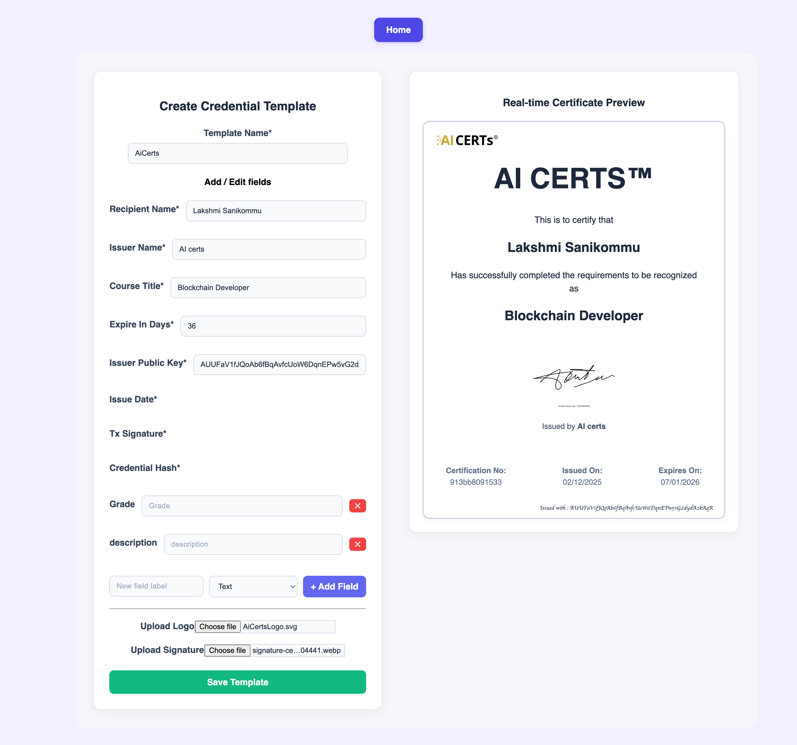
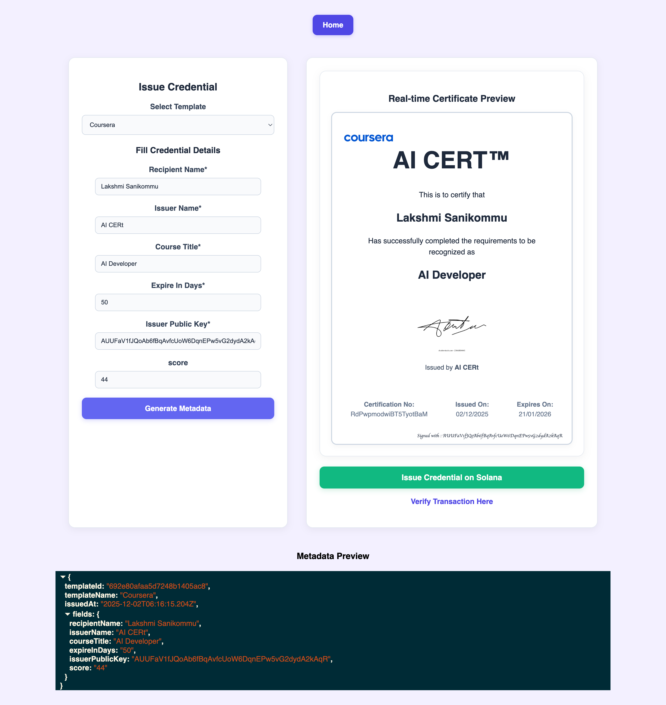
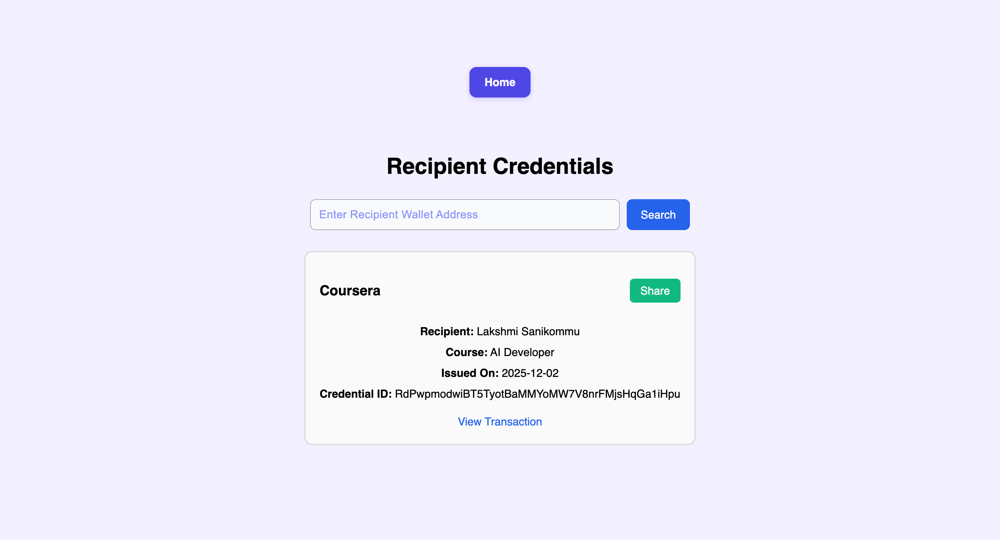
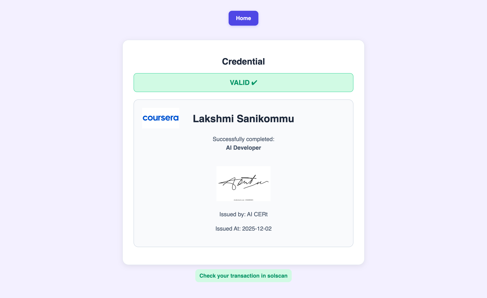

# AICerts — Solana-Based Credential Issuance Platform

A decentralized credential management system built on Solana blockchain that enables secure issuance, storage, and verification of digital certificates.

## 📋 Table of Contents

- [Overview](#-overview)
- [Architecture](#-architecture)
- [Tech Stack](#-tech-stack)
- [Project Structure](#-project-structure)
- [Getting Started](#-getting-started)
- [Features](#features)
- [API Documentation](#-api-documentation)
- [Solana Program](#solana-program)
- [Demo](#-demo)

## 🎯 Overview

AICerts is a hybrid on-chain/off-chain credential issuance platform that leverages Solana's blockchain for immutable proof storage while maintaining cost efficiency by storing detailed metadata off-chain in MongoDB.

**Live Website**: [https://frontend-aicerts-solana-project.vercel.app/](https://frontend-aicerts-solana-project.vercel.app/)

**Smart Contract Address**: `EtcxZLVKnZBwHsMgFt8kuAZ3eenMgcZi5YWSNGmJYxDA`

## 🏗 Architecture

### Hybrid Design Philosophy

**On-Chain Storage (Solana PDA)**

- Credential hash (32 bytes)
- Owner public key
- Credential ID (PDA public key)

**Off-Chain Storage (MongoDB)**

- Complete metadata JSON
- Template ID
- Logo & signature (base64/URL)
- Transaction signature
- Issuer public key
- Issue date & expiry
- Shareable link

### Why Hybrid?

- ✅ Cost-effective (on-chain storage is expensive)
- ✅ Immutable proof on blockchain
- ✅ Flexible metadata management
- ✅ Efficient verification via hash comparison

### System Flow

```
┌───────────────────────┐
│   Issuer Dashboard    │
│ (Create Templates)    │
└───────────┬───────────┘
            │
            │ POST Template
            ▼
┌───────────────────────────┐
│ Backend (Express + Mongo) │
│ Store Templates/Metadata  │
└───────────┬───────────────┘
            │
            │ Issue Credential
            ▼
┌───────────────────────────┐
│ Backend Solana Service    │
│ • Hash metadata           │
│ • Derive PDA              │
│ • Submit transaction      │
└──────────┬────────────────┘
           │
           ▼
┌──────────────────────┐
│  Solana Blockchain   │
│ Store hash + owner   │
└──────────┬───────────┘
           │
           │ Verification
           ▼
┌──────────────────────┐
│  Recipient View UI   │
│ Verify credentials   │
└──────────────────────┘
```

## 🛠 Tech Stack

| Layer                     | Technology                |
| ------------------------- | ------------------------- |
| Frontend                  | React + Vite + TypeScript |
| Backend                   | Node.js + Express.js      |
| Database                  | MongoDB (Mongoose)        |
| Blockchain                | Solana + Anchor Framework |
| Hashing                   | SHA-256 (js-sha256)       |
| Wallet Integration        | Phantom / Solana Web3.js  |
| Smart Contract Deployment | Solana Devnet             |
| Application Deployment    | Vercel                    |

## FrontEnd ( React + TypeScript)

- Init :: npm create vite@latest frontend

- Live website :: https://frontend-aicerts-solana-project.vercel.app/

- To run locally ::

```
  cd frontend
  npm install
  npm run dev
```

- Pages
  - Issuer Dashboard - http://localhost:5173/createTemplate :: [reference](#issuer-dashboard)
  - Issue Credential Screen - http://localhost:5173/issueCredential :: [reference](#issue-credential-screen)
  - Recipient View Page - http://localhost:5173/recipientView :: [reference](#recipient-view)
  - Verification Page - http://localhost:5173/verification :: [reference](#verification-flow)

## solana ( Anchor Framework )

- Init :: anchor init solana

- To Build :: anchor build

- IDL (Interface Description Language) - target/idl/solana.json

## backend (Node.js + Express + MongoDB)

- INIT :: npx express-generator-typescript backend

- TO run Locally ::

```
cd backend
npm install
npm run dev:hot
```

- APIS

  - /api/templates - POST call to create a template
  - /api/templates - GET call to get all the available templates
  - /api/credentials - POST call to store metadata
  - /api/credentials - GET call to fetch all the credentials issued
  - /api/credentials/by-name - POST call to fetch credentials based on Recipient Name
  - /api/credentials/verify/:credentialId - GET call to verify the certificateId/credentialId issued on solana

## 📁 Project Structure

```
aicerts-solana-project/
│
├── backend/
│   ├── src/
│   │   ├── controllers/      # Request handlers
│   │   ├── models/            # MongoDB schemas
│   │   ├── routes/            # API routes
│   │   ├── services/          # Business logic
│   ├── .env
│   └── package.json
│
├── frontend/
│   ├── src/
│   │   ├── components/        # Reusable UI components
│   │   ├── pages/             # Application pages
│   │   ├── idl/solana.json    # Program interface
│   │   └── utils/             # Helper functions
│   └── package.json
│
└── programs/
    └── solana/
        ├── src/lib.rs         # Solana program code
        ├── Cargo.toml
        └── Anchor.toml
```

## 🚀 Getting Started

### Prerequisites

- Node.js (v16 or higher)
- Solana CLI
- Anchor Framework
- MongoDB
- Phantom Wallet

### Frontend Setup

```bash
cd frontend
npm install
npm run dev
```

The application will be available at `http://localhost:5173`

### Backend Setup

```bash
cd backend
npm install
npm run dev:hot
```

The API server will start on the configured port.

### Solana Program

```bash
cd programs/solana
anchor build
```

The compiled IDL will be available at `target/idl/solana.json`

## Features

### 1. Issuer Dashboard

**Route**: `/createTemplate`

Create custom certificate templates with:

- Dynamic field management (add/edit/delete)
- Logo and signature upload
- Real-time certificate preview
- Template persistence to MongoDB



### 2. Issue Credential Screen

**Route**: `/issueCredential`

Issue credentials with the following workflow:

- Select from existing templates
- Fill credential-specific fields
- Connect issuer wallet
- Backend generates metadata hash
- PDA derived using: `[metadata_hash + issuer_pubkey]`
- Hash and owner stored on-chain
- Complete metadata stored off-chain



### 3. Recipient View

**Route**: `/recipientView`

Recipients can:

- View all issued credentials
- Display certificates in styled format
- Generate shareable credential links



### 4. Verification Flow

**Route**: `/verification`

Verify credentials through:

1. Enter credential ID
2. Fetch PDA account from blockchain
3. Retrieve stored metadata from backend
4. Compare hashes
5. Display result: **VALID** or **INVALID**



## 📡 API Documentation

### Templates

**Create Template**

```http
POST /api/templates
Content-Type: application/json

{
  "name": "Template Name",
  "fields": [...],
  "logo": "base64_string",
  "signature": "base64_string"
}
```

**Get All Templates**

```http
GET /api/templates
```

### Credentials

**Store Credential Metadata**

```http
POST /api/credentials
Content-Type: application/json

{
  "templateId": "...",
  "metadata": {...},
  "issuerPublicKey": "...",
  "txSignature": "..."
}
```

**Get All Credentials**

```http
GET /api/credentials
```

**Get Credentials by Recipient Name**

```http
POST /api/credentials/by-name
Content-Type: application/json

{
  "recipientName": "John Doe"
}
```

**Verify Credential**

```http
GET /api/credentials/verify/:credentialId
```

## ⚡ Solana Program

### Program Details

**Program ID**: `EtcxZLVKnZBwHsMgFt8kuAZ3eenMgcZi5YWSNGmJYxDA`

**Instruction**: `createCredential`

**Purpose**: Store credential hash and owner in a Program Derived Address (PDA)

### PDA Generation

**Seeds**: `["credential", owner_pubkey, credential_hash]`

**Stored Fields**:

```rust
pub struct Credential {
    pub credential_hash: [u8; 32],
    pub owner: Pubkey,
}
```

**Returned Value**: PDA public key serves as the `credentialId`

### Frontend-Blockchain Interaction

#### Issuance Flow (Backend)

1. Receive metadata JSON
2. Generate hash: `sha256(JSON.stringify(metadata))`
3. Derive PDA using seeds
4. Call `createCredential` instruction
5. Store metadata in MongoDB
6. Return `credentialId` to frontend

#### Verification Flow (Frontend)

1. Fetch metadata from backend API
2. Fetch PDA account from Solana
3. Hash the retrieved metadata
4. Compare with `account.credentialHash`
5. Result: **VALID** (if equal) or **INVALID** (if different)

## 🎥 Demo

Watch the full platform demonstration: [Demo Video](https://1drv.ms/v/s!Au0SRHW_UhEQgQHQ5ZoYtAWdnqhm?e=FcTw9m)

## 📝 Additional Resources

- [System Architecture Diagram](images/Untitled-2025-07-13-1128.png)
- [Anchor Framework Documentation](https://www.anchor-lang.com/)
- [Solana Documentation](https://docs.solana.com/)

## 🤝 Contributing

Contributions are welcome! Please feel free to submit a Pull Request.

## 📄 License

This project is open source and available under the MIT License.

---

Built with ❤️ using Solana, React, and Node.js
